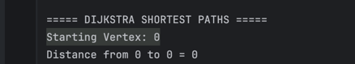
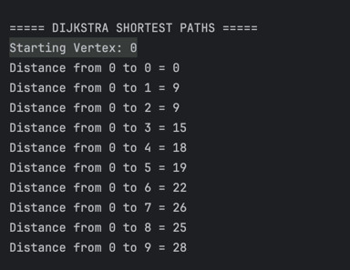
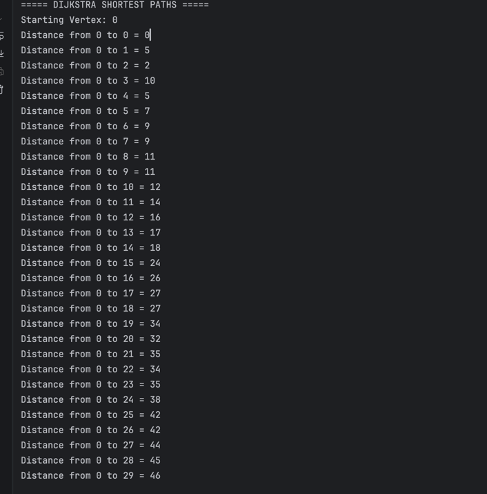
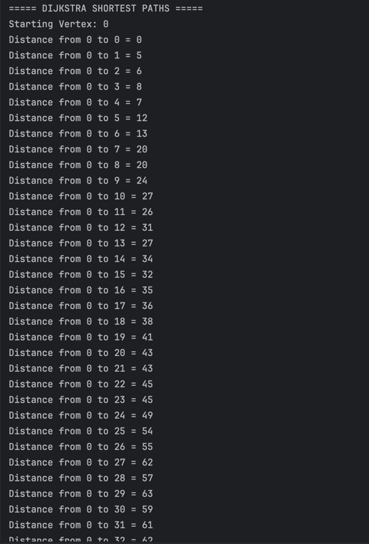
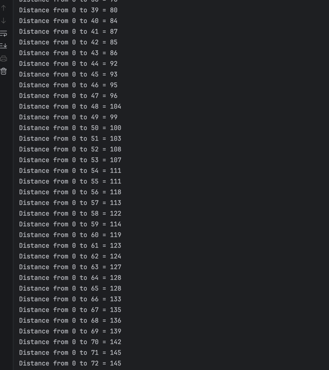
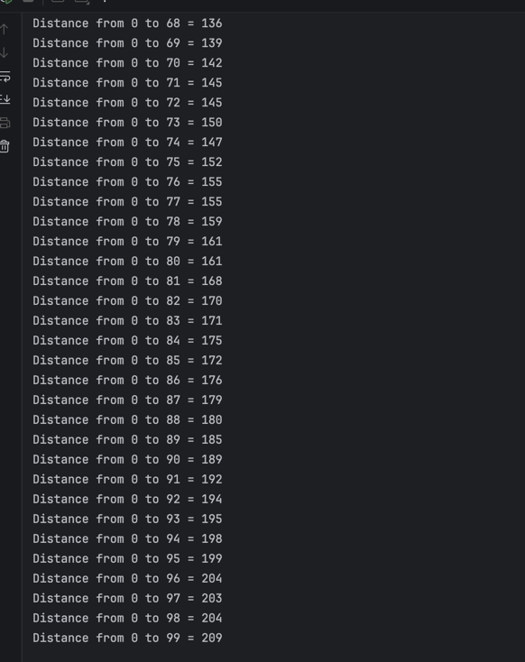
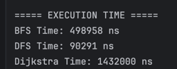
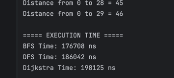
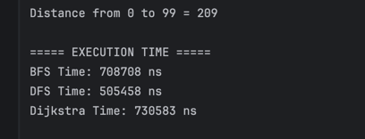

# Assignment 4 — Graph Traversal and Representation System

## Student Information

- Name: Togzhan Sharken 
- Course: Algorithms and Data Structures
- Assignment: Assignment 4
- Topic: Graph Traversal and Representation System
 

---


# Bonus Task — Dijkstra’s Algorithm

## Overview

I upgraded edge, experiment, graph for bonus task. The goal of the Dijkstra's algorithm is to find the minimum distance from one starting vertex to all other vertices in the graph.  The implementation was written using adjacency lists, arrays and loops without using a Priority Queue.

---

## Dijkstra's algorithm
When the algorithm finds the shortest path between two nodes, that node is tagged as
"visited" and added to the path
The method is repeated until the path contains all the nodes in the graph
Only graphs with positive weights can be used by Dijkstra's Algorithm. This is because the weights of the edges must be added
---

## Weighted edges

Weighted edges were added by extending the `Edge` class with a `weight` field and updating the graph structure to support weighted connections. Dijkstra’s algorithm was implemented to calculate the shortest distance from a selected starting vertex to all other vertices in the graph. 

---

# Graph Structure

The graph stores:

- vertices
- weighted edges
- adjacency lists

The `Edge` class was modified by adding a `weight` field.

```java
private Vertex source;
private Vertex destination;
private int weight;
```

Graph output:

```text
===== GRAPH STRUCTURE =====
0 -> 1(9) 2(9) 
1 -> 2(4) 3(9) 
2 -> 3(6) 4(9) 
3 -> 4(5) 5(4) 
4 -> 5(2) 6(4) 
5 -> 6(7) 7(7) 
6 -> 7(7) 8(3) 
7 -> 8(9) 9(2) 
8 -> 9(4) 
9 -> 
```

The number in parentheses represents the edge weight.

---

# How the Algorithm Works

The algorithm starts from a selected vertex.

Initial setup:

- distance to the starting vertex = `0`
- distance to all other vertices = `Infinity`
- all vertices are marked as unvisited

Example:

```java
Starting Vertex: 0
```


A `visited` array is used to track processed vertices.

```java
boolean[] visited = new boolean[size];
```

At every iteration the algorithm:

1. Finds the closest unvisited vertex
2. Marks it as visited
3. Updates distances to neighboring vertices
4. Repeats until all vertices are processed

Main relaxation step:

```java

if (!visited[neighbor]
        && distances[currentVertex] != Integer.MAX_VALUE
                        && distances[currentVertex] + weight < distances[neighbor]) {

distances[neighbor] = distances[currentVertex] + weight;
```

This step checks whether a shorter path was found through the current vertex.

---

# Example Output

## Graph with 10 Vertices
Screenshot:



The output shows the minimum distance from vertex `0` to every other vertex.

## Graph with 30 Vertices
Screenshot:




## Graph with 100 Vertices
Screenshot:




---

# Performance Analysis

The program was tested on graphs with:

- 10 vertices
- 30 vertices
- 100 vertices

## Execution Time — 10 Vertices


## Execution Time — 30 Vertices


## Execution Time — 100 Vertices


Dijkstra’s Algorithm requires more processing because it constantly searches for the minimum distance and updates paths between vertices.

---

# Time Complexity

Since the implementation does not use a Priority Queue, the time complexity is:

```text
O(V²)
```

Where:

- `V` = number of vertices

The algorithm repeatedly scans all vertices to find the smallest unvisited distance.

---

# Conclusion

The bonus task successfully implemented Dijkstra’s shortest path algorithm for weighted graphs.

The implementation included:

- weighted edges
- adjacency lists
- distance tracking
- visited vertex tracking
- shortest path relaxation

The algorithm correctly computed shortest distances for graphs with 10, 30, and 100 vertices.

This project provided practical experience with weighted graph processing, shortest path algorithms, and performance analysis in Java.


---

# Project Overview

This project demonstrates the implementation of graph traversal algorithms using Java and Object-Oriented Programming principles.

The system represents graphs using an adjacency list structure and supports:

- Breadth-First Search (BFS)
- Depth-First Search (DFS)

The project includes:

- Graph creation
- Vertex and edge management
- Graph traversal
- Performance analysis using execution time measurements

Graphs of different sizes were tested:

- Small graph (10 vertices)
- Medium graph (30 vertices)
- Large graph (100 vertices)

---

# Graph Structure

A graph is a data structure consisting of:

- Vertices (nodes)
- Edges (connections between nodes)

This project uses a directed graph structure.

Example:

0 → 1 → 2 → 3

The graph is implemented using an adjacency list.

---

# Adjacency List Representation

The adjacency list stores neighbors of each vertex.

Example:

```text
0 -> 1 2
1 -> 2 3
2 -> 3 4


```

Advantages of adjacency list:

- Memory efficient
- Faster traversal for sparse graphs
- Easier neighbor iteration

---

# Class Descriptions

## Vertex Class

Represents a graph vertex.

### Fields

- `id` — unique vertex identifier

### Methods

- Constructor
- Getter
- `toString()`

---

## Edge Class

Represents a connection between two vertices.

### Fields

- `source`
- `destination`

### Methods

- Constructor
- Getters
- `toString()`

---

## Graph Class

Represents the graph structure using an adjacency list.

### Main Methods

- `addVertex(Vertex v)`
- `addEdge(int from, int to)`
- `printGraph()`
- `bfs(int start)`
- `dfs(int start)`

---

## Experiment Class

Responsible for testing and performance analysis.

### Main Methods

- `runTraversals(Graph g)`
- `runMultipleTests()`
- `printResults()`

---

# Breadth-First Search (BFS)

Breadth-First Search explores the graph level by level.

BFS uses a Queue data structure following FIFO order.

## BFS Steps

1. Start from a selected vertex
2. Mark the vertex as visited
3. Add it to the queue
4. Remove a vertex from the queue
5. Visit all unvisited neighbors
6. Repeat until queue becomes empty

## BFS Use Cases

- Shortest path in unweighted graphs
- Network broadcasting
- Social network analysis
- GPS navigation systems

## BFS Time Complexity

O(V + E)

Where:

- V = number of vertices
- E = number of edges

---

# Depth-First Search (DFS)

Depth-First Search explores deeply before backtracking.

DFS uses recursion (stack behavior).

## DFS Steps

1. Start from a selected vertex
2. Mark current vertex as visited
3. Visit an unvisited neighbor
4. Continue deeper recursively
5. Backtrack when no neighbors remain

## DFS Use Cases

- Cycle detection
- Path finding
- Topological sorting
- Maze solving

## DFS Time Complexity

O(V + E)

Where:

- V = number of vertices
- E = number of edges

---

# Experimental Results

The program was tested on graphs of different sizes.

## Execution Time Results

| Graph Size | BFS Time (ns) | DFS Time (ns) |
|------------|---------------|---------------|
| 10 vertices | 843042        | 106958        |
| 30 vertices | 234541        | 423708        |
| 100 vertices | 550459        | 901500        |

---

# Observations and Analysis

## How graph size affects BFS and DFS performance

As the graph size increases, execution time also increases because more vertices and edges must be visited.

Both algorithms demonstrate scalable behavior.

---

## Which traversal was faster?

In most experiments, DFS was slightly faster because recursion avoids some queue operations used in BFS.

However, the difference was relatively small.

---

## Do results match expected complexity?

Yes.

The results follow the theoretical complexity:

O(V + E)

Execution time increased proportionally with graph size and number of edges.

---

## How graph structure affects traversal order

Traversal order depends on how vertices are connected.

- BFS visits vertices level-by-level
- DFS visits vertices deeply before backtracking

Different edge arrangements produce different traversal sequences.

---

## When is BFS preferred over DFS?

BFS is preferred when:

- Shortest path is required
- Level-order traversal is needed
- Finding minimum distance between nodes

---

## What are the limitations of DFS?

Depth-First Search has several limitations.
DFS does not guarantee the shortest path between vertices because it explores one branch deeply before checking others.
In very large graphs, recursive DFS may also cause stack overflow due to deep recursion.
Additionally, DFS can spend a long time exploring unnecessary paths before reaching the target vertex.

---

## BFS and DFS Traversal Output, Performance Results


---

# Reflection

Through this assignment, I learned how graph traversal algorithms work and how graphs can be represented efficiently using adjacency lists.

I also improved my understanding of Object-Oriented Programming by separating the project into multiple classes such as Vertex, Edge, Graph, and Experiment.

One important difference between BFS and DFS is the traversal strategy. BFS explores graphs level-by-level using a queue, while DFS explores deeply using recursion.

One challenge during implementation was managing visited vertices correctly to avoid infinite traversal loops.

Overall, this project helped me better understand graph structures, traversal algorithms, and performance analysis.

---

# Technologies Used

- Java
- Object-Oriented Programming
- Adjacency List
- BFS Algorithm
- DFS Algorithm

---

# Repository Structure

```text
assignment4-graphs/
├── src/
│   ├── Vertex.java
│   ├── Edge.java
│   ├── Graph.java
│   ├── Experiment.java
│   └── Main.java
├── docs/
│   ├── screenshots/
│   └── diagrams/
├── README.md
└── .gitignore
```


# Conclusion

This project successfully implemented graph traversal algorithms using adjacency list representation.
The experiments demonstrated that both BFS and DFS operate efficiently with time complexity O(V + E).
The project also showed practical differences between traversal methods and their applications in real-world systems.
Overall, this assignment improved understanding of graph algorithms, adjacency list structures, and performance analysis in Java.